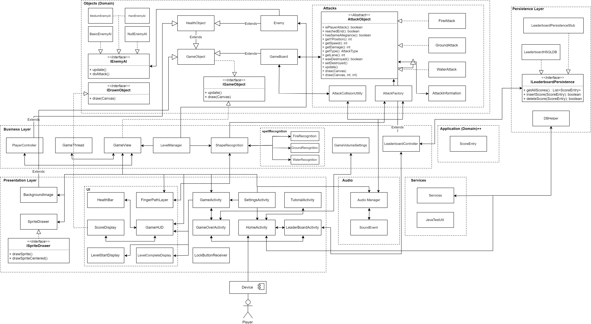

# Project Architecture

## Packages

*"Identify packages and major source code files"*

* `presentation` represents the visual layer of our application. Classes in this package are concerned with how things are drawn to the screen or layouts are displayed.
- `business` is the package that represents the logic layer of our application. Classes in this package perform the calculations and operations behind the objects that are displayed. This class includes non-visual objects that manage the game elements and conduct the flow of the application.
-  the `persistence` package is the data layer of the application. Classes in this package are concerned with methods such as adding, modifying and removing persistent data.
- the `objects` package contains classes that are used across the presentation and business layers of our architecture. Classes in this package will be represented on the screen, and will also have processing done within them to determine their actions.
- the `application` package represents the domain layer of our architecture. Classes in this package contain responsibilities of all layers of our 3-layer architecture.

## ITERATION 3 ADDITIONS

## Links

* LevelManager (business/LevelManager) needs a reference to PlayerController (business) to increment the score
* All activity classes (presentation) call AudioManager (audio) heavily, except for the Leaderboard activity (presentation)
and the StartingNewLevel activity (presentation)
* GameView (business) calls AudioManager.play (audio)
* GameBoard (objects/attacks) calls AudioManager.play (audio)
* AttackCollisionUtility (objects/attacks) calls AudioManager.play (audio)
* AttackFactory (objects/attacks) calls AudioManager.play (audio)

## Presentation Layer

* BackgroundImage (Presentation)
* LockButtonReceiver (Presentation)
* AttackCollisionUtility (Objects/Attacks)
