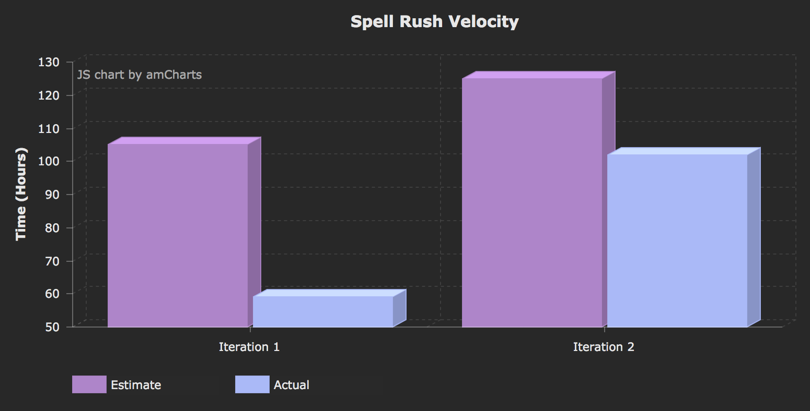

# Our Retrospective Discussion

## What went well

This previous iteration, we got a lot of issues done, which was a great improvement over the last iteration. We only had two issues carried over into the next iteration and spent way more hours total on the project. Part of this was how we started working on the iteration earlier, rather than the week before it was due. Our communication on slack has also continued to be open and sufficient. Our team meetings were very well attended, very structured, and productive. We found that one of the best things we did this past iteration was limiting our scope. Our amount of testing had also improved greatly.

## Part of the project in the last iteration that's not been successful

One problem we faced was having several issues that were 'blocked' by other issues not being completed yet. Likewise, some issues would sit waiting for a review, and so nothing would be getting done at certain times. To improve this, we discussed checking the gitlab and slack more frequently, and suggested more communication when waiting for a review. We also discussed planning our user stories in a way that they wouldn't block each other. To evaluate this, we will see that no issues have ever been assigned the `Blocked` tag in gitlab, and the time from an issue being assigned `In Progress` to being closed is always less than two days.

Merge conflicts were another issue we faced. Our last day of the previous iteration we were cramming to solve merge conflicts. We decided to improve this by discussing how to do them properly in our meeting. We made the requirement of only using an IDE which shows you the `HEAD` and `CHANGE` columns when doing them. We also made the requirement of running the app and all tests afterward, and suggested making smaller commits and merge requests, and merging develop into the branches we're working on <u>often</u>. We'll measure this by seeing if, on the due date, we aren't spending any time dealing with merge conflicts because they were all solved in their respective branches.

A smaller issue this past iteration was that sometimes when we finished issues, we forgot to update them with the actual time spent, and forgot to add new classes to our architecture diagram. We discussed addressing this by (remembering to do them), and specifically looking out for these things whenever we reviewed a merge request. We will measure this success by ensuring that no new classes missing from the architecture diagram when making it, and no issues missing hours when we do our final 'sweep'.

## Velocity

